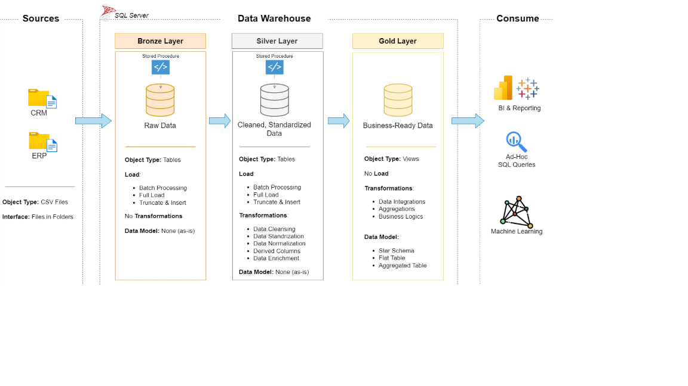

# 🚀 Data Warehouse & Analytics Project

A complete **Data Warehouse and Analytics solution** built with **SQL Server**, covering the full data pipeline from raw source systems to analytical reporting.

This project demonstrates practical skills in **Data Engineering, Data Modeling, ETL, SQL Analytics, and Business Intelligence**.

---

## 📌 Project Overview

The project builds a modern data warehouse that integrates data from **ERP and CRM source systems** and transforms it into a clean analytical model.

The solution follows a **Medallion Architecture** with three layers:

* 🥉 **Bronze** — Raw data ingestion
* 🥈 **Silver** — Data cleansing and transformation
* 🥇 **Gold** — Business-ready analytical data

The final Gold layer is designed for analytical queries and reporting.

---

## 🏗️ Data Architecture

The overall architecture follows a modern **Medallion Data Warehouse Architecture**.



### Architecture Layers

| Layer     | Purpose                                          |
| --------- | ------------------------------------------------ |
| 🥉 Bronze | Store raw data from ERP and CRM systems          |
| 🥈 Silver | Clean, standardize, validate, and transform data |
| 🥇 Gold   | Create business-ready fact and dimension tables  |

---

## 🔄 ETL Pipeline

The ETL process consists of three main stages:

### 1. Extract & Load — Bronze

Raw CSV files from ERP and CRM systems are loaded into the Bronze layer with minimal transformation.

### 2. Clean & Transform — Silver

Data quality issues are identified and resolved, including:

* Missing values
* Duplicate records
* Invalid data
* Inconsistent formats
* Data type issues
* Standardization of business fields

### 3. Business Model — Gold

Cleaned data is transformed into analytical **Fact and Dimension tables** following a Star Schema.

This layer is optimized for SQL analytics and reporting.

---

## 🧩 Data Modeling

The Gold layer uses a **Star Schema** to support analytical queries.

The model separates:

**Fact tables**

* Sales transactions
* Business metrics

**Dimension tables**

* Customers
* Products
* Date
* Other descriptive attributes

This structure improves query performance and makes the data easier for analysts and business users to understand.

---

## 📊 Analytics & Reporting

SQL-based analytics are developed on top of the Gold layer to answer key business questions.

### 👥 Customer Analysis

* Customer purchasing behavior
* Customer segmentation
* Customer lifetime activity
* Customer sales contribution

### 📦 Product Analysis

* Product performance
* Product sales contribution
* Product quantity sold
* Product revenue analysis

### 📈 Sales Analysis

* Total sales
* Sales trends
* Monthly sales performance
* Customer and product contribution
* Revenue analysis

The analytical queries are designed to transform raw business data into **actionable insights for decision-making**.

---

## 🎯 Project Requirements

### Data Engineering

**Objective**

Develop a modern data warehouse using **SQL Server** to consolidate sales data and support analytical reporting.

**Specifications**

* **Data Sources:** ERP and CRM CSV files
* **Data Quality:** Identify and resolve data quality issues
* **Integration:** Combine multiple source systems into a unified data model
* **Scope:** Latest dataset only; historical tracking is not required
* **Documentation:** Document architecture, data flow, data models, and data definitions

### Data Analysis

The analytical layer focuses on:

* Customer Behavior
* Product Performance
* Sales Trends
* Business Metrics

---

## 📁 Project Structure

```text
data-warehouse-project/
│
├── datasets/
│   └── # Raw ERP & CRM datasets
│
├── docs/
│   ├── etl.drawio
│   ├── data_architecture.drawio
│   ├── data_architecture.png
│   ├── data_catalog.md
│   ├── data_flow.drawio
│   ├── data_models.drawio
│   └── naming-conventions.md
│
├── scripts/
│   ├── bronze/
│   │   └── # Raw data ingestion scripts
│   │
│   ├── silver/
│   │   └── # Data cleansing & transformation scripts
│   │
│   ├── gold/
│   │   └── # Analytical model scripts
│   │
│   └── sql-data-analysis/
│       └── # SQL analytical queries
│
├── tests/
│   └── # Data quality & validation tests
│
├── README.md
├── LICENSE
├── .gitignore
└── requirements.txt
```

---

## 🛠️ Technologies Used

| Technology       | Purpose                         |
| ---------------- | ------------------------------- |
| **SQL Server**   | Data Warehouse                  |
| **T-SQL**        | ETL & Analytics                 |
| **Draw.io**      | Architecture & Data Modeling    |
| **CSV**          | Source Data                     |
| **Git / GitHub** | Version Control & Documentation |

---

## 📚 Key Skills Demonstrated

### Data Engineering

* ETL Pipeline Development
* Data Cleaning
* Data Transformation
* Data Integration
* Data Quality

### SQL

* Complex Queries
* CTEs
* Window Functions
* Aggregations
* Joins
* Subqueries
* Analytical SQL

### Data Modeling

* Star Schema
* Fact Tables
* Dimension Tables
* Surrogate Keys
* Analytical Data Models

### Data Analytics

* Customer Analysis
* Product Analysis
* Sales Analysis
* Business KPI Development

## 🎯 Portfolio Objective

This project was developed as a portfolio project to demonstrate practical experience in:

**SQL → ETL → Data Warehouse → Data Modeling → Data Analytics**

It represents an end-to-end analytical data workflow from raw operational data to business-ready insights.
